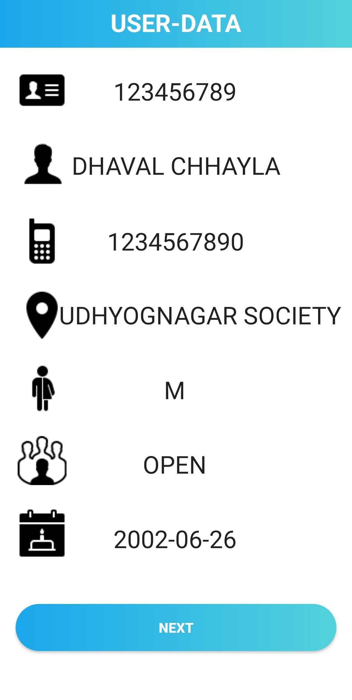

# census-using-QR

<b>Built an application to improve the use of QR-codes in census management, highlighting
their potential benefits such as improved accuracy, reduced time and expenses, and increased public involvement. The
findings demonstrate the speed and accuracy of this innovative method, highlighting the need for further research in
this area. </b>  
- [Project Report](https://drive.google.com/file/d/1YD1eX2howxPnj6lwVympRjQ_KEpXhmTM/view?usp=sharing)

<b>Technology used : </b> 
* Android
* PHP Scripting

<b> IDE : </b> 
* Android Studio  

<b> Database : </b>
* MySQL 

<b> Project Title : </b> 
  * CENSUS MANAGEMENT USING CITIZEN IDENTIFCATION BASED ON QR-CODE

<b> Type of Application: </b>
  * Data Management Application
  
<b> Problem Statement/ Opportunity : </b> 
  * The Census Management Using Citizen Identification Based on QR-Code is an innovative and promising method for precisely and effectively gathering census data. This project report describes how QR-codes can be used to conduct the census, resulting in faster and more accurate data analysis and visualization.
  
<b> Project Description : </b>
  * The project aims to take advantage of the benefits of QR-codes in managing the census data, which 
include improved accuracy, reduced time and expenses, and increased public involvement. The 
project's findings and analysis, as well as the method used to generate the QR-codes and manage 
the census data, are all included in this document.

 * Based on the project's results, QR-codes can significantly speed up the census management process 
and provide a more thorough and precise portrait of the people. This project demonstrated the use 
of QR-codes as a census management tool and identified potential directions for future research in 
this area.

#### App Snapshots

<table>
  <tr>
    <td>Welcome Screen</td>
     <td>Login Screen</td>
     <td>OTP Verification</td>
  </tr>
  <tr>
    <td></td>
    <td></td>
    <td></td>
  </tr>

   <tr>
    <td>Home Page </td>
     <td>QR Scanner</td>
     <td>QR Scanned</td>
  </tr>
  <tr>
    <td></td>
    <td></td>
    <td></td>
  </tr>

  <tr>
    <td>User Data </td>
     <td>Head Details</td>
     <td>Home Details </td>
  </tr>
  <tr>
    <td></td>
    <td></td>
    <td></td>
  </tr>

  <tr>
    <td>Migration Details</td>
     <td>Fertility Details</td>
     <td>Final Conformation</td>
  </tr>
  <tr>
    <td></td>
    <td></td>
    <td></td>
  </tr>
 </table>

 
